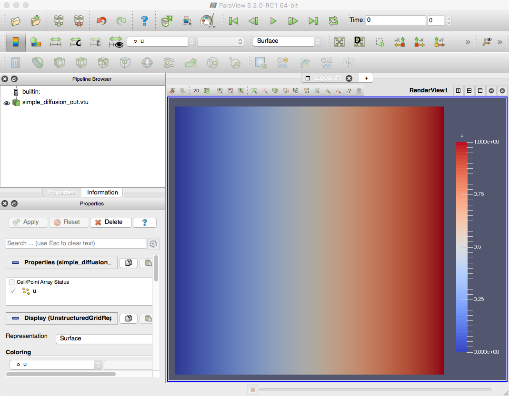

# 2D Laplacian

As a simple example, let's solve `-div grad u = 0` on a square domain, with `u=0` on the left and `u=1` on the right.  Just a simple Laplacian problem.

(TLDR: If you just want to skip ahead and run it... check out the `problems/simple_diffusion` directory for a pre-baked script that solves this problem)

To solve this problem we're going to need to:
 1. Start `using MOOSE`
 1. Create the Geometry
 1. Create a `System`
 1. Add `Variable`s to the `System`
 1. Add `Kernel`s representing our PDE operators acting on our `Variable`s to the `System`
 1. Add some `BoundaryCondition` objects for the left and right boundary
 1. Create a `Solver`
 1. Write out the output using `VTKOutput`
 1. Visualize using Paraview: http://www.paraview.org

Let's get started.  Fire up a Julia terminal and follow along:

## Start Using MOOSE

First, we're going to need to use MOOSE:

```julia
using MOOSE
```

## The Geometry

Currently, MOOSE.jl only has a simple built-in mesh generator.  Luckily for us, it builds rectangular, 2D domains!

The command is: `buildSquare(x_min, x_max, y_min, y_max, n_elems_x, n_elems_y)`

Let's build a 10x10 grid on the (0,1)x(0,1) unit square:

```julia
mesh = buildSquare(0, 1, 0, 1, 10, 10);
```

## Create the `System`

The `System` holds all of the information about the equations to be solved and geometry.  It must be initialized with a `Mesh`

The only real choice when creating a `System` is what type to use for the underlying floating point type.  The parametric type you use is either `Float64` or `Dual{N, Float64}`.  The choice is dependent on whether you want your Jacobian matrices built from manually coded functions (for `Float64`) or whether you want to use automatic differentiation (`Dual`).  We'll talk more about this later.

For now, let's use manually coded Jacobian functions:

```julia
diffusion_system = System{Float64}(mesh);
```

## Add `Variable`s

A `Variable` represents a field over the domain you want to solve for.  It's the "u" in the `-grad^2 u` expression.  Just like that "u" all `Variable`s have a name ("u", "temperature", "displacement", etc.).  To build our equations we're going to apply operators (called `Kernel`s) to the `Variable`s.  But first, we need to add the `Variable`s to the `System`.

In our case, we just have one variable named "u":

```julia
u = addVariable!(diffusion_system, "u");
```

That line of code adds a variable named `u` to the `System` and returns a handle to it.  We can then use that handle to apply `Kernel`s and `BoundaryCondition`s to that `Variable`.  Let's do that now...

## Add `Kernel`s

Each term (operator) in your PDE will be represented by one or more `Kernel`s.  The `-grad^2` operator (in weak form) is what is referred to as the `Diffusion` `Kernel` in MOOSE.  It's already built-in (see `src/kernels/Diffusion.jl`) so the only thing we need to do is apply that operator to our new variable (`u`):

```julia
addKernel!(diffusion_system, Diffusion(u));
```

The `Diffusion(u)` part of that statement creates a `Diffusion` `Kernel` that is acting on our `u` variable.  It's then added to our `diffusion_system`.

If we had more terms in our PDE we would continue to call `addKernel!()`, creating each term and applying it to the appropriate `Variable`.

This brings up a good point about MOOSE.  All of the objects are "reusable".  The `Diffusion` `Kernel` represents the "idea" of the `-grad^2` operator.  That `Diffusion` `Kernel` can be applied to as many variables as you want.  So, if you are solving 16 equations and a `-grad^2` shows up in each one... then you can apply the same `Diffusion` operator to each variable.  This gives us a large amount of code reuse and flexibility.

## `BoundaryCondition`s

Now that we've taken care of our PDE operators, we need to handle the boundary conditions (BCs).  We said we wanted `u=0` on the left of the domain and `u=1` on the right.  A `u=something` BC (aka "essential" BC, aka "BC of the first kind", etc.) is a type of `BoundaryCondition` we refer to as a `DirichletBC`.  Just as with `Kernel`s we can reuse the same object, applying it on different boundaries with different values.

Speaking of "boundaries"... our built-in mesh generator automatically added some "sidesets" and "nodesets" in our `Mesh`.  These are sets of boundary geometry that allow us to specify where `BoundaryCondition`s are applied.  `DirichletBC` objects operate on "nodesets".

For the built-in mesh generator the sidesets/nodesets are as follows:
 * 1: Bottom
 * 2: Right
 * 3: Top
 * 4: Left

By applying `BoundaryCondition` objects to those "boundary IDs" we can select the part of the domain the BC will be applied on.

In our case we need two `DirichletBC`s... one on the left and one on the right with the proper values:

```julia
addBC!(diffusion_system, DirichletBC(u, [4], 0.0));
addBC!(diffusion_system, DirichletBC(u, [2], 1.0));
```

As you can see, a `BoundaryCondition` (like a `Kernel`) first takes the `Variable` it's going to operate on.  Next, comes an array of the boundary IDs it will be applied on and finally, in the case of `DirichletBC`, the last argument specifies the value to enforce.

## Initialization

Our set of equations is now complete.  We've created geometry, added operators and set boundary conditions.  Before we can continue we need to `initialize!()` the `System`:

```julia
initialize!(diffusion_system);
```

This step can do a lot of things... but the main thing it does is distribute all of the Degrees of Freedom (DoFs) corresponding to our `Variable`s across our `Mesh`.  The DoFs are the actually finite-element coefficients we'll be solving for in the next step...

## Solve

Now that the problem is setup we need to actually solve the system of equations.  To do that we're going to create a `Solver` and `solve!()` it.

For now, we're just going to use a simple, direct, built-in linear solver: `JuliaDenseImplicitSolver`:

```julia
solver = JuliaDenseImplicitSolver(diffusion_system);
solve!(solver);
```

As you can see, we needed to tell it which `System` to solve... and then call `solve!()` on the new `Solver` to actually do the solve.

## Output

Once this is complete the solution will be held within the `solver` object.  To output it to a file so we can view it with [Paraview](http://www.paraview.org) we can do:

```julia
out = VTKOutput();
output(out, solver, "simple_diffusion_out");
```

"VTK" is a visualization file format that many third-party visualization tools (such as Paraview) can read.

## Final File

After all of these steps your file should look like:

```julia
using MOOSE

# Create the Mesh
mesh = buildSquare(0, 1, 0, 1, 10, 10)

# Create the System to hold the equations
diffusion_system = System{Float64}(mesh)

# Add a variable to solve for
u = addVariable!(diffusion_system, "u")

# Apply the Laplacian operator to the variable
addKernel!(diffusion_system, Diffusion(u))

# u = 0 on the Left
addBC!(diffusion_system, DirichletBC(u, [4], 0.0))

# u = 1 on the Right
addBC!(diffusion_system, DirichletBC(u, [2], 1.0))

# Initialize the system of equations
initialize!(diffusion_system)

# Create a solver and solve
solver = JuliaDenseImplicitSolver(diffusion_system)
solve!(solver)

# Output
out = VTKOutput()
output(out, solver, "simple_diffusion_out")
```

## Running It

Save the file as `diffusion.jl` and run it like so:

```bash
julia diffusion.jl
```

That last step should have produced a `simple_diffusion_out.vtu` file in your directory.  You can then use [Paraview](http://www.paraview.org) to open the file and view the result:


